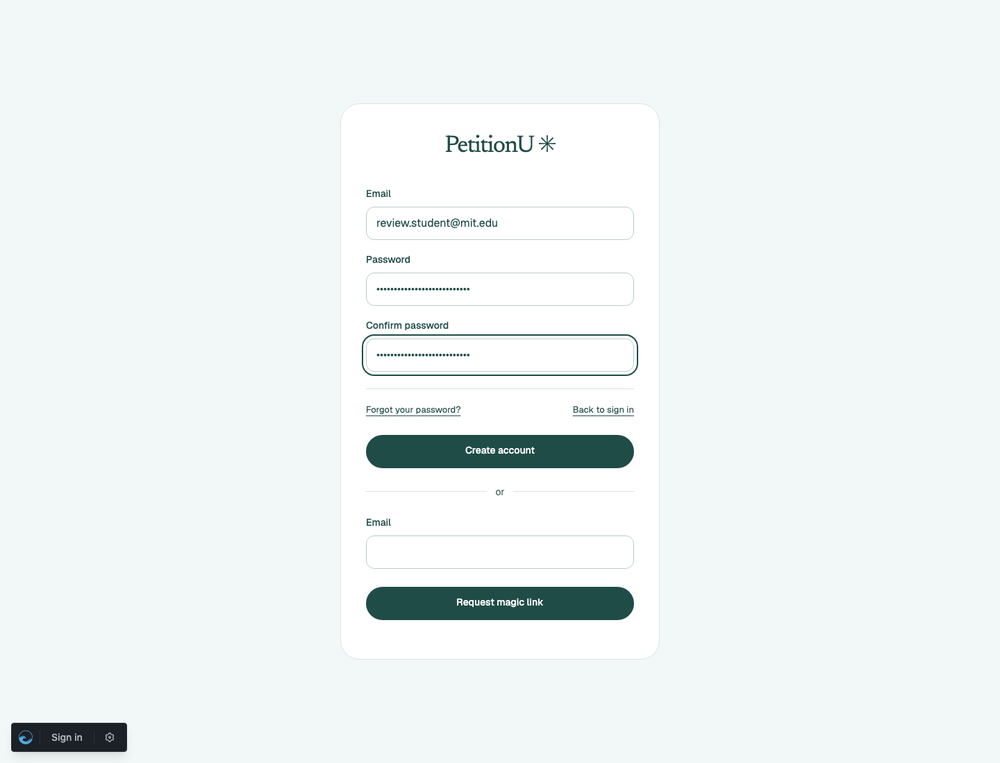
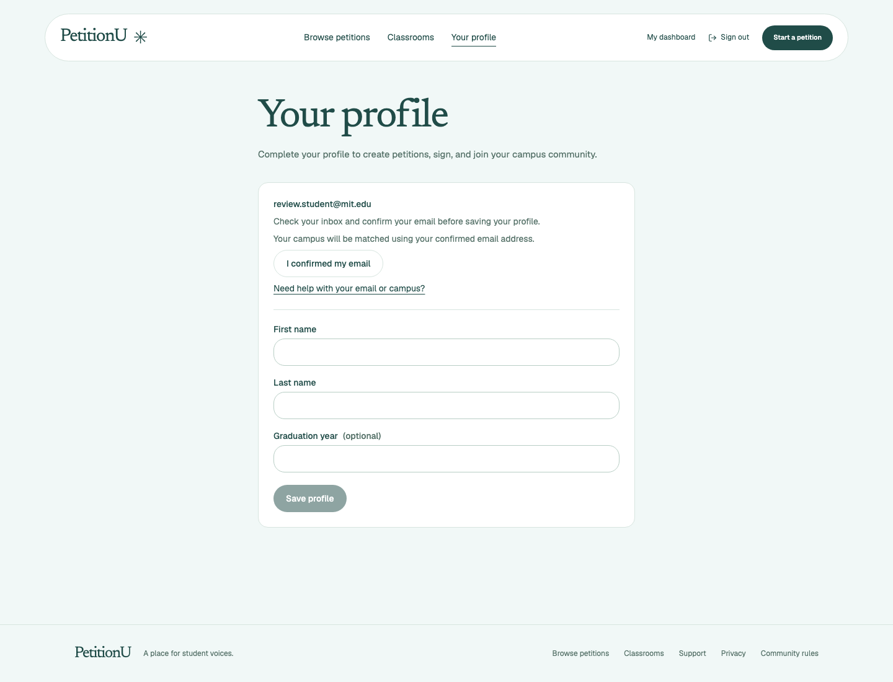
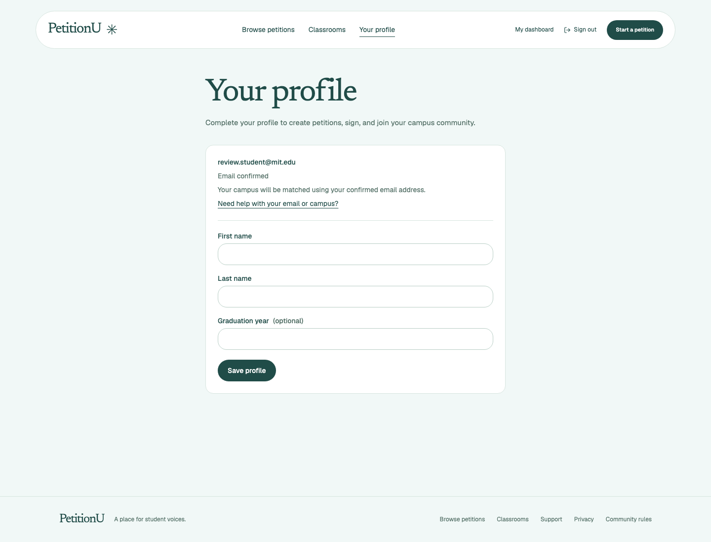
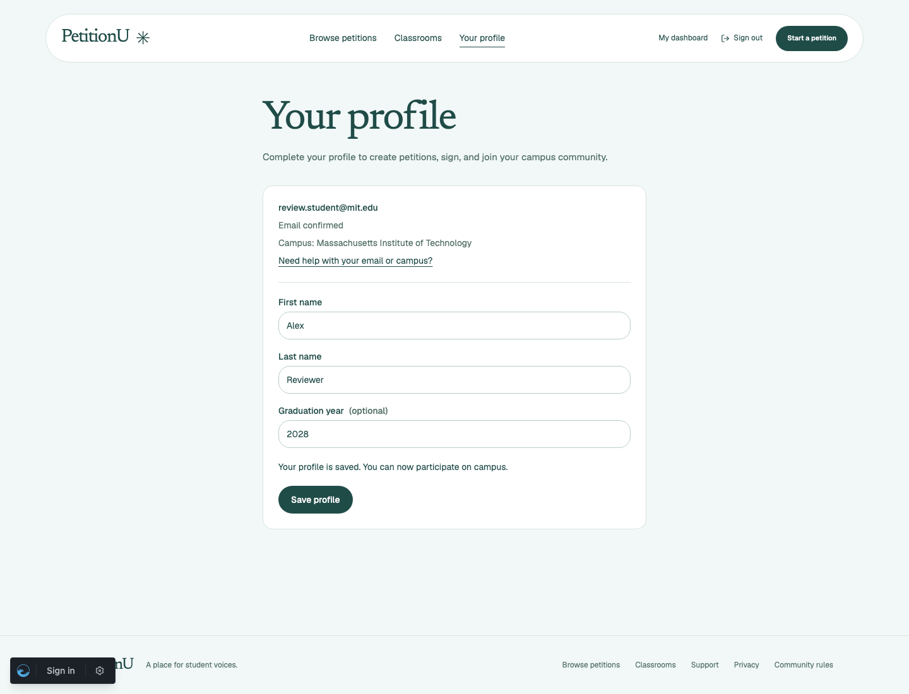
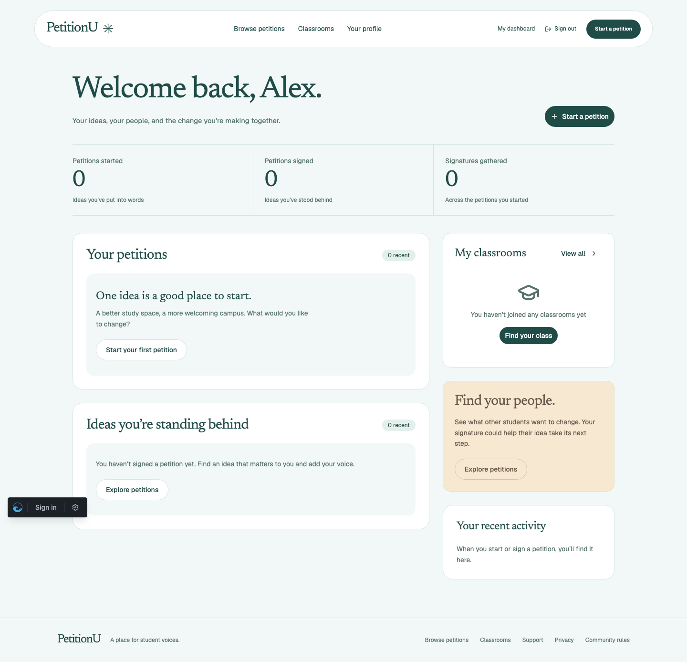

# School signup browser evidence

Captured from this PR branch against a separate local database on September 8,
2026 UTC. `review.student@mit.edu` is a synthetic review account. Swoosh's local
mailbox intercepted its confirmation email. No external inbox received mail.
The registry lookup used the real EDUCAUSE WHOIS server.

## Signup and email confirmation

The account was created through `/register`, using the browser form.

After registration, the session was logged in but the email was unconfirmed.
The database had neither an active nor a pending organization for the user.

The confirmation link came from `/dev/mailbox`. After clicking **Confirm your
email**, the account had a pending `mit.edu` organization and an available Oban
job. Its active organization was still empty. The local queue was paused to
capture this state. The existing profile UI uses generic campus-matching copy.

## Registry verification and participation

Resuming the queue performed a live lookup against `whois.educause.edu`.
The stored result was:

| Field | Observed value |
| --- | --- |
| Domain | `mit.edu` |
| Verification status | `verified` |
| Registry name | Massachusetts Institute of Technology |
| Registry source | `whois.educause.edu` |
| Registry checked at | `2026-09-08 05:19:41.088025 UTC` |
| Job state | `completed` |
| Job attempt | `1` |

The worker assigned the verified organization to the user and cleared the pending
assignment. Refreshing the profile displayed MIT's name. Saving the user's name
and graduation year succeeded.

The same session could open **My dashboard**.

## Automated verification

- `MIX_TEST_PARTITION=school_registry_pr mix test test/petitionu/accounts`: 56 passed.
- `MIX_TEST_PARTITION=school_registry_pr mix precommit`: 127 passed, including frontend formatting, lint, TypeScript, and tooling checks.
- `mix assets.build`: passed.
- `mix ash.codegen --check`: passed.

Account tests also cover `.ac.uk`, explicitly configured domains with other
suffixes, unavailable registries and persistent retries, concurrent first users,
unchanged roles, and protection against profile completion bypassing verification.
